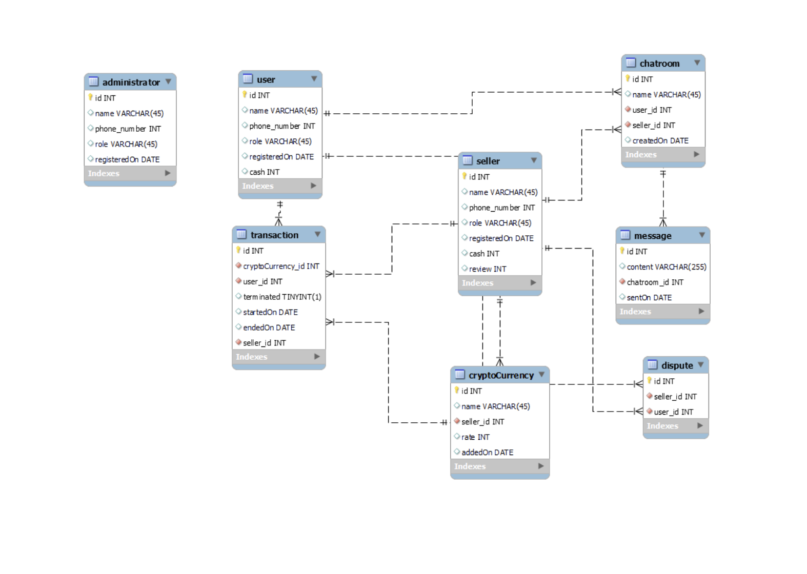
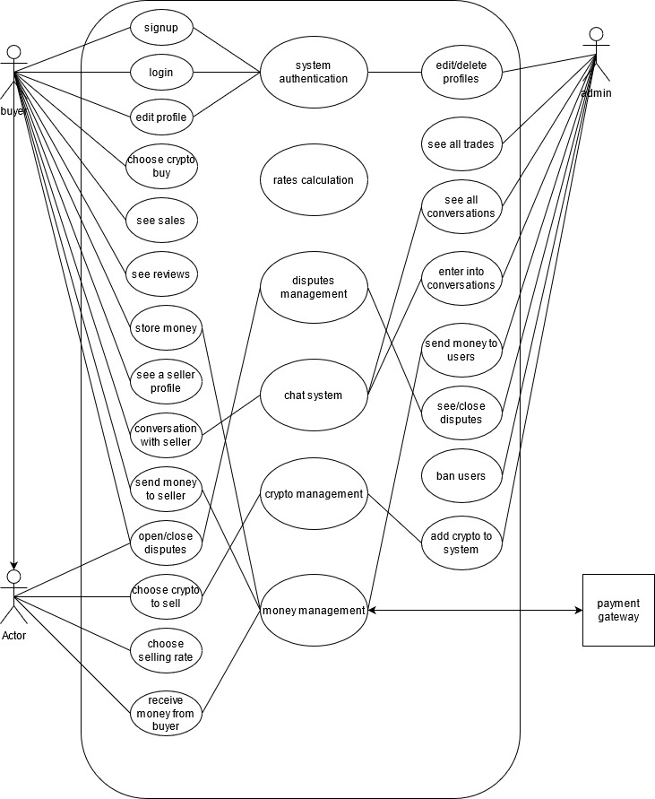

# **Openswap Exchange Platform**

***

## 1 INTRODUCTION 

### 1.1 PURPOSE

The purpose of this platform is to enable and facilitate the purchase, sale, and transfer of cryptocurrencies where participants can freely choose who to sell or buy from depending on their proposed rates.

---

###  1.2 DOCUMENT CONVENTIONS

|Abbrevation|Meaning                  | 
|---        |--------                 |
|DB         |Database                 |
|MYSQL      |Structured Query Language|
|ER         |Entity Relationship      |

---

###  1.3 INTENDED AUDIENCE AND READING SUGGESTIONS

This project is an open-source project, and it is free for anybody who wishes to sell and buy crypto

---

###  1.4 PROJECT SCOPE

Crypto swap is a peer-to-peer cryptocurrency marketplace where buyers and sellers are connected for business, This platform provides a variety of rates for crypto sellers and well-secured payment methods, 
Crypto-swap is 100% decentralized since no one is imposing a price or rates on anyone and the seller can loop through a list of buyers to choose what is best for him.  

---

###  1.5 REFERENCES

|Mr. Jam Stanley| The Co-founder     |
|---------------|---------------     |
|Mr. Fenn       |The conceptualist   |
|paxful.com     |A similar conception| 

---

## 2. OVERALL DESCRIPTION

 ###  2.1 PRODUCT PERSPECTIVE                

 The crypto-swap trading system stores the following information.

- Sellers details 

The history of all transactions made by a seller
The available balance of the seller account 
The phone number and email address of a seller 

- Buyers details 

The history of all transactions made by a buyer
The available balance of the buyer’s account 
The phone number and email address of a seller
 A legal document of a buyer ( ID, passport, drivers linens )

- Moderator details 
      
The history of all transactions made by a moderator
The phone number and email address of a moderator
 A legal document of a buyer ( ID, passport, drivers linens )

This information may be used for keeping the records of the customer for any emergency or for any other kind of information.

---

###  2.2 PRODUCT FEATURES

The major features of the crypto-swap database system as shown in below entity-relationship model (ER model) 

---

###  2.3 USER CLASS and CHARACTERISTICS

Users of the system should be able to retrieve information from the database such as  
- best rate trader
- the fastest trader
- the most reliable trader 

The system will support three types of users privilege, Sellers, Buyer, and Moderator.
A seller will have access to sellers functions, while a buyer will have access to both the seller and the buyer function. A Moderator will have access to the moderator functions. The users should be able to do the following functions:

- SELLERS  
1. see a list of buyers
2. choose which buyer to sell my coins to
3. make sure the buyer is fast in trading
4. see if a buyer is online
5. speak with the buyer
6. send alert to the system that the buyer is not 7. attending to my trade
7. withdraw money from my account to my mtn or orange wallet
8. get notification when a buyer response to my trade
9. give feedback after a trade

- Buyer 
1. get a notification if a seller opens a new trade
2. set my rate
3. see other buyers rate 
4. report a seller if he is wasting my time
5. block a seller if he is not legit
6. deactivate my offers if I am not online
7. get notification each time a new seller opens a trade
8. set my rules that a seller should read before accepting to trade
9. get reviews from sellers
10. give me feedback after each trade
11. open dispute

- Moderator
1. see all the chat
2. get notification each time a dispute is open
3. award dispute
4. delete a user
5. check if a buyer is qualified to buy
6. Set a transaction time frame 

---

###  2.4 OPERATING ENVIRONMENT

The operating environment for this crypto-swap system is as listed below

- distributed database
- client/server system
- Operating system:  Cross-platform.
- database: MySQL
- platform: NodeJS

---

###  2.5 DESIGN and IMPLEMENTATION CONSTRAINTS
 
---

###  2.6 ASSUMPTION DEPENDENCIES

- A dispute can be awarded to the client base on the competent of evidence provided by the client (as requested by the moderator)

- A dispute may take up to 3 working days if enough evidence is not provided by the client 

- A trade may delay due to the failure of a third party ( such as mtn API not responding, network problem, etc)

- Any act of spam or scam may lead to the deletion of a user 

---

## 3. SYSTEM FEATURES

###  3.1 DESCRIPTION AND PRIORITY

- The cryptocurrency exchange platform system facilitates the trading of cryptocurrencies for other assets, including digital and fiat currencies. This platform acts as an intermediary between a buyer and a seller. With the increase in crypto-trading, there is a high number of traders who have no reliable and safe platform for the exchange of their commodities, hence this project is of high priority.

---

###  3.2 STIMULUS/RESPONSE SEQUENCE

- Displays a list of crypto sellers and their rates
- Displays a buy now on a particular deal of interest now
- Users can start a chat or open a dispute

---

###  3.3 FUNCTIONAL REQUIREMENTS:

###  3.3.1 system architecture

---

###  3.4 BEHAVIOURAL REQUIREMENTS:
Behavioral requirements of the system are described using a use case view. The Following use case diagrams summarize the functional and behavioral requirements of the cryptocurrency exchange platform system

---

###  3.4.1 Use case diagram of the Crypto Exchange Platform

---

###  3.4.2  System architecture of the Crypto Exchange Platform

.jpg)

---
## 4. EXTERNAL INTERFACE REQUIREMENTS

###  4.1 USER INTERFACES

Front-end software: ViewJs.
Back-end software: MySQL, Nodejs, Expressjs.

---

###  4.2 HARDWARE INTERFACES

Cross-platform:- Windows, Linux, macOS etc.
A browser that supports HTML & Javascript.

---

###  4.3 SOFTWARE INTERFACES

|Software used| Description|
|-------------|------------|
|Operating system| Cross-platform so that any user can conveniently use the system he is comfortable with.|
|Database |To save the transaction, users’ records we have chosen the MySQL database.|

---

###  4.4 COMMUNICATION INTERFACES

This project supports all types of web browsers. 

---

## 5 NON-FUNCTIONAL REQUIREMENTS:

             
###  5.1 SAFETY/SECURITY REQUIREMENTS

- Whenever a transaction happens, a new block (a block records some or all of the most recent transactions that have not yet entered any previous blocks) will be added with the details of that transaction like date, time, the currency amount in the first section of the block. In the second section of the block, there will be information about the participants(name, address, email of the buyer and the seller) of that transaction. 
- Automatic login is not allowed.
- The database should be SQL because of its high emphasis on securing data.
- Due to the monetary nature of the app, it is important that at any given point in time, there be a backup of the activities being performed. This is to ensure easy data recovery in case of database failure.
